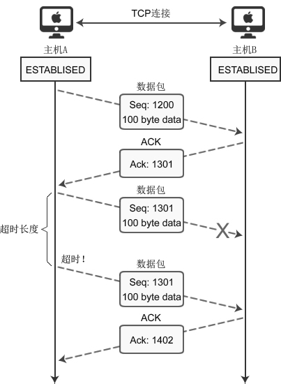

# socket是什么？套接字是什么？

## 什么是socket？

socket的原意是插座，在计算机通信领域，socket被翻译为套接字，  
它是计算机之间进行通信的一种约定或一种方式。  
通过socket这种约定，一台计算机可以接收其他计算机的数据，  
也可以向其他计算机发送数据。

socket的典型应用就是Web服务器和浏览器：  
浏览器获取用户输入的URL，向服务器发起请求，  
服务器分析接收到的URL，将对应的网页内容返回给浏览器，  
浏览器再经过解析和渲染，就将文字、图片、视频等元素呈现给用户。

学习socket，也就是学习计算机之间如何通信，并编写出实用的程序。

## UNIX/Linux中的socket是什么？

在UNIX/Linux系统中，为了统一对各种硬件的操作，  
简化接口，不同的硬件设备也都被看成一个文件。  
对这些文件的操作，等同于对磁盘上普通文件的操作。  
网络连接也是一个文件，它也有文件描述符！你必须理解这句话。

可以通过socket()函数来创建一个网络连接，  
或者说打开一个网络文件，socket()的返回值就是文件描述符。  
有了文件描述符，就可以使用普通的文件操作函数来传输数据了，例如：
- 用read()读取从远程计算机传来的数据；
- 用write()向远程计算机写入数据。
  
只要用socket()创建了连接，剩下的就是文件操作了，网络编程原来就是如此简单！ 

## Window系统中的socket是什么？

Windows也有类似文件描述符的概念，但通常被称为文件句柄。  
与UNIX/Linux不同的是，Windows会区分socket和文件，  
Windows就把socket当做一个网络连接来对待，  
因此需要调用专门针对socket而设计的数据传输函数，  
针对普通文件的输入输出函数就无效了。

# 套接字有哪些类型？socket有哪些类型？

这个世界上有很多种套接字（socket），比如：  
- DARPA Internet地址，Internet套接字
- 本地节点的路径名，Unix套接字
- CCITT X.25地址，X.25套接字，等。

但第一种Internet套接字，它是最具代表性的，也是最经典最常用的，  
一般提及套接字，指的都是Internet套接字。

根据数据的传输方式，可以将Internet套接字分成两种类型。  
通过socket()函数创建连接时，必须告诉它使用哪种数据传输方式。

## 流格式套接字（SOCK_STREAM）

流格式套接字（Stream Sockets）也叫面向连接的套接字，  
在代码中使用SOCK_STREAM表示。

SOCK_STREAM是一种可靠的、双向的通信数据流，  
数据可以准确无误地到达另一台计算机，如果损坏或丢失，可以重新发送。

SOCK_STREAM有以下几个特征：
- 数据在传输过程中不会消失；
- 数据是按照顺序传输的；
- 数据的发送和接收不是同步的，也称不存在数据边界。

可以将SOCK_STREAM比喻成一条传送带，  
只要传送带本身没有问题（不会断网），就能保证数据不丢失；

同时，较晚传送的数据不会先到达，较早传送的数据不会晚到达，  
这就保证了数据是按照顺序传递的。

为什么流格式套接字可以达到高质量的数据传输呢？  
这是因为它使用了TCP协议（The Transmission Control Protocol，传输控制协议），  
TCP协议会控制数据按照顺序到达并且没有错误。

TCP用来确保数据的正确性，IP（Internet Protocol，网络协议）用来路由，  
控制数据如何从源头到达目的地。

那么，数据的发送和接收不同步该如何理解呢？  
流格式套接字的内部有一个缓冲区（也就是字符数组），  
通过socket传输的数据将保存到这个缓冲区。

接收端在收到数据后并不一定立即读取，只要数据不超过缓冲区的容量，  
接收端有可能在缓冲区被填满以后一次性地读取，也可能分成好几次读取。  
也就是说，不管数据分几次传送过来，接收端只需要根据自己的要求读取，  
不用非得在数据到达时立即读取。  
传送端有自己的节奏，接收端也有自己的节奏，它们是不一致的。

流格式套接字有什么实际的应用场景吗？  
浏览器所使用的http协议就基于面向连接的套接字，  
因为必须要确保数据准确无误，否则加载的HTML将无法解析。 

## 数据报格式套接字（SOCK_DGRAM）

数据报格式套接字（Datagram Sockets）也叫无连接的套接字，  
在代码中使用SOCK_DGRAM表示。

计算机只管传输数据，不作数据校验，如果数据在传输中损坏，  
或者没有到达另一台计算机，是没有办法补救的。  
也就是说，数据错了就错了，无法重传，因为数据报套接字所做的校验工作少，  
所以在传输效率方面比流格式套接字要高。

可以将SOCK_DGRAM比喻成高速移动的摩托车快递，它有以下特征：
- 强调快速传输而非传输顺序；
- 传输的数据可能丢失也可能损毁；
- 限制每次传输的数据大小；
- 数据的发送和接收是同步的，存在数据边界，换句话说，接收次数应该和发送次数相同。

总之，数据报套接字是一种不可靠的、不按顺序传递的、以追求速度为目的的套接字。

数据报套接字也使用IP协议作路由，但是它不使用TCP协议，  
而是使用UDP协议（User Datagram Protocol，用户数据报协议）。

QQ视频聊天和语音聊天就使用SOCK_DGRAM来传输数据，  
因为首先要保证通信的效率，尽量减小延迟，而数据的正确性是次要的，  
即使丢失很小的一部分数据，视频和音频也可以正常解析，  
最多出现噪点或杂音，不会对通信质量有实质的影响。  
SOCK_DGRAM没有想象中的糟糕，不会频繁的丢失数据，数据错误只是小概率事件。

# 面向连接和无连接的套接字到底有什么区别

流格式套接字（Stream Sockets）就是面向连接的套接字，它基于TCP协议；  
数据报格式套接字（Datagram Sockets）就是无连接的套接字，它基于UDP协议。

## 无连接的套接字

对于无连接的套接字，每个数据包可以选择不同的路径，  
也可以选择相同的路径，那也只不过是巧合而已。  
每个数据包之间都是独立的，各走各的路，谁也不影响谁，  
除了迷路的或者发生意外的数据包，最后都能到达，但是，  
到达的顺序是不确定的，总之，对于无连接的套接字，  
数据包在传输过程中会发生各种不测，也会发生各种奇迹。  
发送端只负责把数据包发出，至于它什么时候到达，  
先到达还是后到达，有没有成功到达，发送端都不管了；  
接收端也没有选择的权利，只能被动接收，收到什么算什么，爱用不用。  
无连接套接字遵循的是尽最大努力交付的原则，就是尽力而为，  
实在做不到了也没办法，无连接套接字提供的没有质量保证的服务。 

## 面向连接的套接字

面向连接的套接字在正式通信之前要先确定一条路径，  
没有特殊情况的话，以后就固定地使用这条路径来传递数据包了。  
当然，路径被破坏的话，比如某个路由器断电了，那么会重新建立路径。  
这条路径是由路由器维护的，路径上的所有路由器都要存储该路径的信息，  
实际上只需要存储上游和下游的两个路由器的位置就行，所以路由器是有开销的。  
一般称这条预先建立好的路径被称为虚电路，就是一条虚拟的通信电路。  
为了保证数据包准确、顺序地到达，发送端在发送数据包以后，  
必须得到接收端的确认才发送下一个数据包；  
如果数据包发出去了，一段时间以后仍然没有得到接收端的回应，  
那么发送端会重新再发送一次，直到得到接收端的回应。  
这样一来，发送端发送的所有数据包都能到达接收端，并且是按照顺序到达的。 

发送端发送一个数据包，如何得到接收端的确认呢？  
为每一个数据包分配一个ID，接收端接收到数据包以后，  
再给发送端返回一个数据包，告诉发送端我接收到了ID为xxx的数据包。

面向连接的套接字会比无连接的套接字多出很多数据包，  
因为发送端每发送一个数据包，接收端就会返回一个数据包。  
此外，建立连接和断开连接的过程也会传递很多数据包。

不但是数量多了，每个数据包也变大了：  
除了源端口和目的端口，面向连接的套接字还包括序号、确认信号、  
数据偏移、控制标志（通常说的URG、ACK、PSH、RST、SYN、FIN）、  
窗口、校验和、紧急指针、选项等信息；  
而无连接的套接字则只包含长度和校验和信息。  
有连接的数据包比无连接大很多，这意味着更大的负载和更大的带宽。  
许多即时聊天软件采用UDP协议（无连接套接字），与此有莫大的关系。

##  总结
两种套接字各有优缺点：
1. 无连接套接字传输效率高，但是不可靠，有丢失数据包、捣乱数据的风险；  
2. 有连接套接字非常可靠，万无一失，但是传输效率低，耗费资源多。

两种套接字的特点决定了它们的应用场景，有些服务对可靠性要求比较高，  
必须数据包能够完整无误地送达，就得选择有连接的套接字，比如HTTP、FTP等；  
而另一些服务，并不需要那么高的可靠性，效率和实时才是它们所关心的，  
那就可以选择无连接的套接字（UDP服务），比如DNS、即时聊天工具等。

# OSI网络七层模型简明教程

    OSI模型      TCP/IP模型
    7 应用层
    6 表示层     
    5 会话层     4 应用层   常用协议：HTTP、FTP、SMTP（简单邮件协议）等
    4 传输层     3 传输层   确认数据传输及进行纠错处理，常用协议：TCP、UDP
    3 网络层     2 网络层   负责数据的传输，路径及地址的选择，常用的协议：IP、ARP（地址解析协议）
    2 数据链路层
    1 物理层     1 物理层   针对不同物理网络的连接形式的协议，Etherent、FDDI、ATM

socket编程，是站在传输层的基础上，所以可以使用TCP/UDP协议，  
但是不能干访问网页这样的事情，因为访问网页所需要的http协议位于应用层。

# TCP/IP协议族

协议（Protocol）就是网络通信过程中的约定或者合同，  
通信的双方必须都遵守才能正常收发数据，协议有很多种，例如TCP、UDP、IP等，  
通信的双方必须使用同一协议才能通信，协议是一种规范，由计算机组织制定，  
规定了很多细节，例如，如何建立连接，如何相互识别等。   
协议仅仅是一种规范，必须由计算机软件来实现，例如IP协议规定了如何找到目标计算机，  
那么各个开发商在开发自己的软件时就必须遵守该协议，不能另起炉灶。

TCP/IP模型包含了TCP、IP、UDP、Telnet、FTP、SMTP等上百个互为关联的协议，  
其中TCP和IP是最常用的两种底层协议，所以把它们统称为TCP/IP协议族。

也就是说，TCP/IP模型中所涉及到的协议称为TCP/IP协议族，  
可以区分这两个概念，也可以认为它们是等价的，随便怎么想。

# IP、MAC和端口号——网络通信中确认身份信息的三要素

在茫茫的互联网海洋中，要找到一台计算机非常不容易，  
有三个要素必须具备，它们分别是IP地址、MAC地址和端口号。

## IP地址

IP地址是Internet Protocol Address的缩写，译为网际协议地址。  
目前大部分软件使用IPv4地址，但IPv6也正在被接受，尤其是教育网，已经大量使用。  
一台计算机可以拥有一个独立的IP地址，  
一个局域网也可以拥有一个独立的IP地址（对外就好像只有一台计算机）。  
于目前广泛使用IPv4地址，它的资源是非常有限的，  
一台计算机一个IP地址是不现实的，往往是一个局域网才拥有一个IP地址。  
在因特网上进行通信时，必须要知道对方的IP地址。

实际上数据包中已经附带了IP地址，把数据包发送给路由器以后，  
路由器会根据IP地址找到对方的地里位置，完成一次数据的传递。  
路由器有非常高效和智能的算法，很快就会找到目标计算机。 

## MAC地址

现实的情况是，一个局域网往往才能拥有一个独立的IP；  
换句话说，IP地址只能定位到一个局域网，  
无法定位到具体的一台计算机，这可怎么办呀？  
这样也没法通信啊，其实，真正能唯一标识一台计算机的是MAC地址，  
每个网卡的MAC地址在全世界都是独一无二的。  
计算机出厂时，MAC地址已经被写死到网卡里面了，  
当然通过某些奇巧淫技也是可以修改的。  
局域网中的路由器/交换机会记录每台计算机的MAC地址。  
MAC地址是Media Access Control Address的缩写，  
直译为媒体访问控制地址，也称为局域网地址（LAN Address），  
以太网地址（Ethernet Address）或物理地址（Physical Address）。  
数据包中除了会附带对方的IP地址，还会附带对方的MAC地址，  
当数据包达到局域网以后，路由器/交换机会根据MAC地址找到对应的计算机，  
然后把数据包转交给它，这样就完成了数据的传递。

## 端口号

有了IP地址和MAC地址，虽然可以找到目标计算机，但仍然不能进行通信。  
一台计算机可以同时提供多种网络服务，例如Web服务（网站）、  
FTP服务（文件传输服务）、SMTP服务（邮箱服务）等，  
仅有IP地址和MAC地址，计算机虽然可以正确接收到数据包，  
但是却不知道要将数据包交给哪个网络程序来处理，  
所以通信失败，为了区分不同的网络程序，  
计算机会为每个网络程序分配一个独一无二的端口号（Port Number），  
例如，Web服务的端口号是80，FTP服务的端口号是21，  
SMTP服务的端口号是25，端口是一个虚拟的、逻辑上的概念。  
可以将端口理解为门，数据通过这道门流入流出，每道门有不同的编号，就是端口号。

# TCP通信过程

## TCP数据报结构

1. 序号，Seq（Sequence Number）序号占32位，  
   用来标识从计算机A发送到计算机B的数据包的序号，计算机发送数据时对此进行标记。
2. 确认号，Ack（Acknowledge Number）确认号占32位，  
   客户端和服务器端都可以发送，Ack = Seq + 1。
3. 标志位，每个标志位占用1Bit，共有6个，  
   分别为 URG、ACK、PSH、RST、SYN、FIN，具体含义如下：
   - URG，紧急指针（urgent pointer）有效；
   - ACK，确认序号有效；
   - PSH，接收方应该尽快将这个报文交给应用层；
   - RST，重置连接；
   - SYN，建立一个新连接；
   - FIN，断开一个连接。

对英文字母缩写的总结：
- Seq是Sequence的缩写，表示序列；
- Ack是Acknowledge的缩写，表示确认；
- SYN是Synchronous的缩写，原意是同步的，这里表示建立同步连接；
- FIN是Finish的缩写，表示完成。

## TCP状态转换

## 通信过程

TCP通信过程包括三个步骤：  
建立TCP连接通道（三次握手）、数据传输、断开TCP连接通道（四次挥手）。

### 三次握手

客户端在收发数据前要使用connect()函数和服务器建立连接。  
建立连接的目的是保证IP地址、端口、物理链路等正确无误，为数据的传输开辟通道。   
TCP建立连接时要传输三个数据包，俗称三次握手（Three-way Handshaking）。  
可以形象的比喻为下面的对话：  
    [Shake 1]套接字A：“你好，套接字B，我这里有数据要传送给你，建立连接吧。”  
    [Shake 2]套接字B：“好的，我这边已准备就绪。”  
    [Shake 3]套接字A：“谢谢你受理我的请求。”

#### 建立连接（three-way hand shake）

- 主动打开：服务器必须准备好接受外来的连接，通常通过socket、bind和listen完成。
- 被动打开：客户端通过connect发起主动打开。

使用connect()建立连接时，客户端和服务器端会相互发送三个数据包。

客户端调用socket()函数创建套接字后，因为没有建立连接，处于CLOSED状态；  
服务器端调用listen()函数后，套接字进入LISTEN状态，开始监听客户端请求。   
客户端主动连接：
1. 当客户端调用connect()函数后，TCP协议会组建一个数据包，  
   并设置SYN标志位，表示该数据包是用来建立同步连接的。   
   同时生成一个随机数字1000，填充序号（Seq）字段，表示该数据包的序号。   
   完成这些工作，开始向服务器端发送数据包，客户端就进入了SYN-SEND状态。
2. 服务器端收到数据包，检测到已经设置了SYN标志位，  
   就知道这是客户端发来的建立连接的请求包。   
   服务器端也会组建一个数据包，并设置SYN和ACK标志位，  
   SYN表示该数据包用来建立连接，ACK用来确认收到了刚才客户端发送的数据包。  
   服务器生成随机数2000，填充序号（Seq）字段，2000和客户端数据包没有关系。  
   服务器将客户端数据包序号1000加1，得到1001，  
   并用这个数字填充确认号（Ack）字段。  
   服务器将数据包发出，进入SYN-RECV状态。
3. 客户端收到数据包，检测到已经设置了SYN和ACK标志位，  
   就知道这是服务器发来的确认包，客户端会检测确认号（Ack）字段，  
   看它的值是否为1000+1，如果是就说明连接建立成功。  
   接下来，客户端会继续组建数据包，并设置ACK标志位，  
   表示客户端正确接收了服务器发来的确认包。    
   同时，将刚才服务器发来的数据包序号（2000）加1，  
   得到2001，并用这个数字来填充确认号（Ack）字段。  
   客户端将数据包发出，进入ESTABLISED状态，表示连接已经成功建立。
4. 服务器端收到数据包，检测到已经设置了ACK标志位，  
   就知道这是客户端发来的确认包，服务器会检测确认号（Ack）字段，  
   看它的值是否为2000+1，如果是就说明连接建立成功，服务器进入ESTABLISED状态。

至此，客户端和服务器都进入了ESTABLISED状态，连接建立成功，就可以收发数据了。 

通过握手流程可以得知：
- 客户端的connect在三次握手的第二次返回；
- 而服务器端的accept在三次握手的第三次返回。

#### 同时打开：
是指发生在两端几乎同时发送SYN并且这两个SYN在网络中交错的情形，    
这种情况可能发生，但是非常罕见。  
例如，主机A的应用程序使用本地端口7777，并与主机B的端口8888执行主动打开。  
主机B的应用程序使用本地端口8888，并与主机A的端口7777执行主动打开。  
许多伯克利版的TCP实现都不能正确地支持打开。

#### 建立连接失败1：
考虑场景，客户端尚未接收到服务器ACK+SYN，异常退出（崩溃退出）。  
这时，当客户端接收到服务器的ACK+SYN时，客户端回复RST（reset）。  
此时服务器处于SYN_RCVD状态，当接收到客户端RST时，  
则从SYN_RCVD转移到LISTEN状态。

具体过程：
1. 服务器准备好接受外来连接，通常通过socket、bind和listen完成。  
   服务器：CLOSED->LISTEN
2. 客户端通过connect连接服务器，客户端TCP将发送一个SYN包，  
   告诉服务器，客户端将在待建立连接发送数据的初始状态，然后客户端异常退出。  
   客户端：CLOSED->SYN_SENT，然后突然crash，则退出SYN_SENT
3. 服务器端ACK客户端SYN，同时发送一个SYN，  
   告诉客户端，服务器将在待建立连接发送数据的初始状态。  
   服务器：SYN_RCVD
4. 客户端找不到服务器ACK+SYN对应的SYN_SENT状态的socket，则响应RST。  
   服务器：SYN_RCVD->LISTEN

#### 建立连接失败2：  
考虑场景1，服务器的进程异常退出，客户端不知道。  
那么客户端发送SYN后，服务器端响应RST，则客户端建立连接失败。

考虑场景2，服务器机器关闭，导致服务器IP不可达，那么客户端发送SYN后，  
超时重发，超过重试次数，最终TIMEOUT，则客户端建立连接失败。

具体过程：
1. 假设服务器进程退出。  
   服务器：LISTEN->CLOSED
2. 客户端通过connect连接服务器，客户端TCP将发送一个SYN包，  
   告诉服务器，客户将在待建立连接发送数据的初始状态。  
   客户端：CLOSED->SYN_SENT
3. 服务器端收到客户端SYN，响应RST。  
   服务器：CLOSED
4. 客户收到RST。  
   客户端：SYN_SENT->CLOSED

#### 为什么是三次握手：

在谢希仁著《计算机网络》第四版中讲三次握手的目的是：  
为了防止已失效的连接请求报文段突然又传送到了服务端，因而产生错误。  
在另一部经典的《计算机网络》中讲三次握手的目的是：  
为了解决网络中存在延迟的重复分组的问题。

在谢希仁著《计算机网络》书中同时举了一个例子，如下：  
已失效的连接请求报文段的产生在这样一种情况下：  
client发出的第一个连接请求报文段并没有丢失，  
而是在某个网络结点长时间的滞留了，  
以致延误到连接释放以后的某个时间才到达server。  
本来这是一个早已失效的报文段，但server收到此失效的连接请求报文段后，  
就误认为是client再次发出的一个新的连接请求。  
于是就向client发出确认报文段，同意建立连接。  
假设不采用三次握手，那么只要server发出确认，新的连接就建立了。  
由于现在client并没有发出建立连接的请求，  
因此不会理睬server的确认，也不会向server发送数据。  
但server却以为新的运输连接已经建立，并一直等待client发来数据。  
这样，server的很多资源就白白浪费掉了。  
采用三次握手的办法可以防止上述现象发生。  
例如刚才那种情况，client不会向server的确认发出确认。  
server由于收不到确认，就知道client并没有要求建立连接。

### 数据传输

主机A分2次（分2个数据包）向主机B传递200字节的过程。  
首先，主机A通过1个数据包发送100个字节的数据，数据包的Seq号设置为1200。  
主机B为了确认这一点，向主机A发送ACK包，并将Ack号设置为1301。  
为了保证数据准确到达，目标机器在收到SYN包、FIN包、普通数据等包后，  
必须立即回传ACK包，这样发送方才能确认数据传输成功。  
此时Ack号为1301而不是1201，原因在于Ack号的增量为传输的数据字节数。  
假设每次Ack号不加传输的字节数，这样虽然可以确认数据包的传输，  
但无法明确100字节全部正确传递还是丢失了一部分，比如只传递了80字节。  
因此按如下的公式确认Ack号：Ack号 = Seq号 + 传递的字节数 + 1   
与三次握手协议相同，最后加1是为了告诉对方要传递的Seq号。

通过Seq1301数据包向主机B传递100字节的数据，但中间发生了错误，主机B未收到。  
经过一段时间后，主机A仍未收到对于Seq1301的ACK确认，因此尝试重传数据。  
为了完成数据包的重传，TCP套接字每次发送数据包时都会启动定时器，  
如果在一定时间内没有收到目标机器传回的ACK包，那么定时器超时，数据包会重传。  
也会有ACK包丢失的情况，一样会重传。

重传超时时间（RTO, Retransmission Time Out）  
这个值太大了会导致不必要的等待，太小会导致不必要的重传，  
理论上最好是网络RTT时间，但又受制于网络距离与瞬态时延变化，  
所以实际上使用自适应的动态算法来确定超时时间，例如Jacobson算法和Karn算法等。

往返时间（RTT，Round-Trip Time）  
表示从发送端发送数据开始，接收端收到数据后便立即确认，  
到发送端收到来自接收端的ACK确认包，总共经历的时延。

重传次数
TCP数据包重传次数根据系统设置的不同而有所区别。  
有些系统，一个数据包只会被重传3次，  
如果重传3次后还未收到该数据包的ACK确认，就不再尝试重传。  
但有些要求很高的业务系统，会不断地重传丢失的数据包，  
以尽最大可能保证业务数据的正常交互。

发送端只有在收到对方的ACK确认包后，才会清空输出缓冲区中的数据。

### 四次挥手

建立连接非常重要，它是数据正确传输的前提；  
断开连接同样重要，它让计算机释放不再使用的资源。  
如果连接不能正常断开，不仅会造成数据传输错误，  
还会导致套接字不能关闭，持续占用资源，如果并发量高，服务器压力堪忧。

建立连接需要三次握手，断开连接需要四次握手，可以形象的比喻为下面的对话：  
    [Shake 1]套接字A：“任务处理完毕，我希望断开连接。”  
    [Shake 2]套接字B：“哦，是吗？请稍等，我准备一下。”  
    等待片刻后……  
    [Shake 3]套接字B：“我准备好了，可以断开连接了。”  
    [Shake 4]套接字A：“好的，谢谢合作。”

由于TCP连接是全双工的，因此每个方向都必须单独进行关闭，  
也就是发送方和接收方都需要Fin和Ack。  
这个原则是当一方完成它的数据发送任务后就能发送一个FIN来终止这个方向的连接，  
收到一个FIN只意味着这一方向上没有数据流动，  
一个TCP连接在收到一个FIN后仍能发送数据。  
首先进行关闭的一方将执行主动关闭，而另一方执行被动关闭。  
这里假定客户端主动关闭，实际上谁先执行主动关闭没本质区别：
- 主动关闭（active close）：某个应用程序首先调用close，发送一个FIN包。
- 被动关闭（passive close）：接收到FIN的对端执行被动关闭。

对于四次挥手，其实仔细看是两次，因为TCP是全双工的，  
必须双方都关闭才可以，单方会有两次，共有四次。    
终止的时候，有一方是被动的，所以看上去就成了四次挥手。

建立连接后，客户端和服务器都处于ESTABLISED状态。  
这时，客户端发起断开连接的请求：
1. 客户端调用close()后，向服务器发送FIN数据包，表示完成任务需要断开连接。  
   客户端ESTABLISHED状态进入FIN_WAIT_1状态。  
2. 服务器收到数据包后，检测到设置了FIN标志位，  
   知道要断开连接，于是向客户端发送确认包。  
   服务端从ESTABLISHED进入CLOSE_WAIT状态。  
   服务器收到请求后并不是立即断开连接，而是先向客户端发送确认包，  
   告诉它我知道了，需要准备一下才能断开连接。  
   所以CLOSE_WAIT这个状态是让服务器发送还未传送完的数据。
3. 客户端收到确认包后从FIN_WAIT_1状态进入FIN_WAIT_2状态，  
   等待服务器准备完毕后再次发送数据包。
4. 等待片刻后，服务器准备完毕，可以断开连接，于是再主动向客户端发送FIN包，  
   告诉它我准备好了，断开连接吧，然后进入LAST_ACK状态。
5. 客户端收到服务器的FIN包后，再向服务器发送ACK包，  
   告诉它你断开连接吧，然后进入TIME_WAIT状态。
6. 服务器收到客户端的ACK包后，就断开连接，关闭套接字，进入CLOSED状态。 

#### 关于TIME_WAIT状态的说明

TCP是面向连接的传输方式，必须保证数据能够正确到达目标机器，  
不能丢失或出错，而网络是不稳定的，随时可能会毁坏数据。

客户端最后一次发送ACK包后进入TIME_WAIT状态，  
而不是直接进入CLOSED状态关闭连接，这是为什么呢？  
TIME_WAIT状态存在的原因有两点：
1. 可靠的终止TCP连接；
2. 保证让迟来的TCP报文段有足够的时间被识别并丢弃。

第一点很好解释，如果网络不可靠，  
那么就无法保证最后客户端发送的ACK报文服务器端一定能够收到。  
客户端最后一次向服务器回传ACK包时，  
处于LAST_ACK状态的服务器有可能会因为网络问题导致服务器收不到，  
服务器会再次发送FIN包，如果这时客户端完全关闭了连接，  
那么服务器无论如何也收不到ACK包了，所以客户端需要等待片刻、  
确认对方收到ACK包后才能进入CLOSED状态。  
因此客户端需要停留在TIME_WAIT状态一段时间以处理重复收到的报文段。  
如果没有这个TIME_WAIT状态，客户端处于CLOSED状态，那么客户端将响应RST，  
服务器端收到后会将该RST分节解释成一个错误，  
也就不能实现最后的全双工关闭了（主动方单方的关闭）。  
所以用TIME_WAIT状态来保证TCP连接的可靠终止。

那么，要等待多久呢？
数据包在网络中是有生存时间的，  
超过这个时间还未到达目标主机就会被丢弃，并通知源主机。  
这称为报文最大生存时间（MSL，Maximum Segment Lifetime）。  
TIME_WAIT要等待2MSL才会进入CLOSED状态。  
ACK包到达服务器需要MSL时间，服务器重传FIN包也需要MSL时间，  
2MSL是数据包往返的最大时间，如果2MSL后还未收到服务器重传的FIN包，  
就说明服务器已经收到了ACK包。

第二个原因：比如在客户端收到ACK后如果立即关闭，  
虽然这个端口已经关闭，但如果有一个新的连接被建立起来，  
使用的IP地址和端口和这个先前到达了CLOSED状态的完全相同，  
假定原先的连接中还有数据报残存在网络之中，  
这样新的连接建立以后传输的数据极有可能就是原先的连接的数据报，  
为了防止这一点，TCP不允许从处于TIME_WAIT的socket建立一个连接，  
处于TIME_WAIT的socket在等待了两倍的MSL之后，将会转变为CLOSED状态。  
MSL是任何IP数据报能够在因特网中存活的最长时间，  
TIME_WAIT状态持续的时间是2MSL，足以让这两个方向上的数据包被丢弃。  
通过实施这个规则，我们就能保证每成功建立一个TCP连接时，  
来自该连接先前化身的老的重复分组都已经在网络中消逝了。  

综上来看，TIME_WAIT存在的两个理由就是
- 可靠地实现TCP全双工连接的终止；
- 让老的重复数据报在网络中消逝。

#### 断开连接同时关闭

通常但不总是客户方发送第一个FIN执行主动关闭。  
双方都执行主动关闭也是可能的，TCP协议也允许这样的同时关闭。

#### 断开连接（在FIN_WAIT_1状态中，接收FIN+ACK）

考虑场景：被动关闭端收到FIN包后，直接发送FIN+ACK，  
则主动关闭方则从FIN_WAIT_1跳过FIN_WAIT_2，直接进入TIME_WAIT。

具体流程：
1. 某个应用程序首先调用close，该端发送一个FIN包，  
   表示数据发送完毕，该应用程序再无更多数据发送给对端。  
   例如HTTP服务器发送Reponse数据给client后，  
   再无多余数据发送，则Server可以执行主动关闭。  
   主动端：ESTABLISHED->FIN_WAIT_1
2. 接受到FIN的对端执行被动关闭，收到FIN包之后，  
   被动端调用close关闭socket，则FIN+ACK同时发给主动端。  
   被动端：ESTABLISHED->CLOSE_WAIT->LAST_ACK，  
   主动端：FIN_WAIT_1->TIME_WAIT  
3. 接收这个最终FIN的执行主动关闭的那一端ACK这个FIN。  
   被动端：LAST_WAIT->CLOSED，  
   主动端：FIN_WAIT_1->TIME_WAIT(2MSL之后，TIME_WAIT->CLOSED)）

# UDP和TCP

TCP是面向连接的传输协议，建立连接时要经过三次握手，  
断开连接时要经过四次握手，中间传输数据时也要回复ACK包确认，  
多种机制保证了数据能够正确到达，不会丢失或出错。

UDP是非连接的传输协议，没有建立连接和断开连接的过程，  
它只是简单地把数据丢到网络中，也不需要ACK包确认。

UDP传输数据就好像我们邮寄包裹，邮寄前需要填好寄件人和收件人地址，  
之后送到快递公司即可，但包裹是否正确送达、是否损坏无法得知，也无法保证。  
UDP协议也是如此，它只管把数据包发送到网络，然后就不管了，  
如果数据丢失或损坏，发送端是无法知道的，当然也不会重发。

既然如此，TCP应该是更加优质的传输协议吧？  
如果只考虑可靠性，TCP的确比UDP好，但UDP在结构上比TCP更加简洁，  
不会发送ACK的应答消息，也不会给数据包分配Seq序号，  
所以UDP的传输效率有时会比TCP高出很多，编程中实现UDP也比TCP简单。

UDP的可靠性虽然比不上TCP，但也不会像想象中那么频繁地发生数据损毁，  
在更加重视传输效率而非可靠性的情况下，UDP是一种很好的选择。  
比如视频通信或音频通信，就非常适合采用UDP协议；  
通信时数据必须高效传输才不会产生卡顿现象，用户体验才更加流畅，  
如果丢失几个数据包，视频画面可能会出现雪花，  
音频可能会夹带一些杂音，这些都是无妨的。

与UDP相比，TCP的生命在于流控制，这保证了数据传输的正确性。

最后需要说明的是：  
TCP的速度无法超越UDP，但在收发某些类型的数据时有可能接近UDP。   
例如，每次交换的数据量越大，TCP的传输速率就越接近于UDP。
